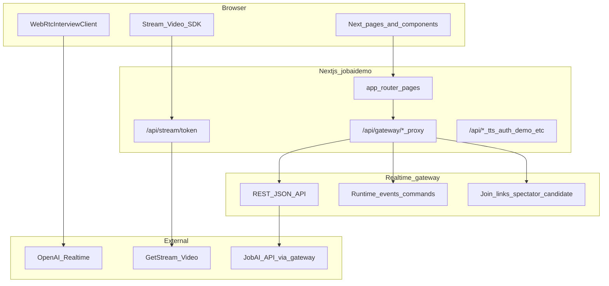
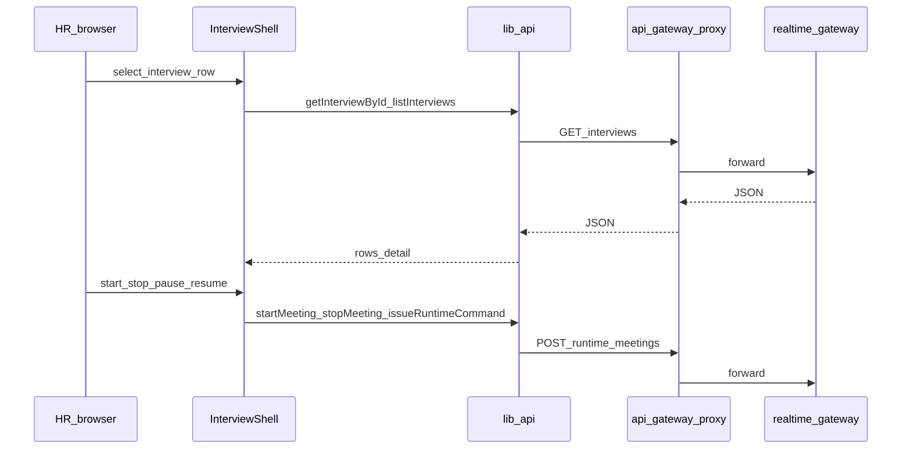

# NULLXES HR AI — архитектура фронтенда (`jobaidemo`)

Сквозной обзор **фронт + `realtime-gateway` + API + голос/текст**: [SYSTEM_OVERVIEW.md](./SYSTEM_OVERVIEW.md).

Документ описывает **как устроен фронтенд** в каталоге `frontend/jobaidemo`: страницы Next.js, прокси к `realtime-gateway`, поток интервью (WebRTC + Stream), основные хуки и компоненты. Цель — дать карту «от NULLXES до браузера» без привязки к конкретному коммиту.

---

## 1. Роль приложения в продукте

`jobaidemo` — это **Next.js 16** приложение (React 19), которое:

1. Отдаёт **HR-дашборд** и **кандидатский flow** на одной домашней странице (`InterviewShell`).
2. Проксирует вызовы к **backend `realtime-gateway`** через безопасный маршрут `/api/gateway/*` (allowlist путей).
3. Выдаёт **Stream Video** токены и роли через серверный route `/api/stream/token`.
4. Поднимает **OpenAI Realtime** сессию в браузере через `WebRtcInterviewClient` и шлёт телеметрию/события на gateway.

Внешние системы в схеме:

- **JobAI** — источник списка/деталей интервью и статусов; фронт ходит в gateway, который уже знает как маппить JobAI.
- **Stream (GetStream)** — видеокомната (кандидат, HR-аватар pod, наблюдатель).
- **OpenAI Realtime** — голосовой агент (WebRTC DataChannel + аудио).

---

## 2. Высокоуровневая схема (NULLXES → браузер → сервисы)

**Важно:** браузер **не** ходит напрямую на `BACKEND_GATEWAY_URL` из клиентского кода для основного API — используется относительный путь `/api/gateway/...`, а уже Next (server) проксирует на gateway (см. `app/api/gateway/[...path]/route.ts`).

---

## 3. Карта каталогов (что где лежит)

| Путь | Назначение |
|------|------------|
| `app/` | App Router: страницы (`page.tsx`), layout, **Route Handlers** (`app/api/**/route.ts`). |
| `app/page.tsx` | Корень продукта: рендерит `InterviewShell` (HR + кандидат в одном дереве, режим переключается query/entry). |
| `app/spectator/page.tsx` | Отдельная страница наблюдателя (spectator dashboard). |
| `app/join/candidate/[token]/page.tsx` | Вход кандидата по signed JWT в URL. |
| `app/join/spectator/[token]/page.tsx` | Вход внешнего наблюдателя по signed JWT. |
| `app/api/gateway/[...path]/route.ts` | Reverse-proxy на `realtime-gateway` с allowlist сегментов. |
| `app/api/stream/token/route.ts` | Серверная выдача Stream user token + нормализация ролей (candidate / spectator / internal observer publish). |
| `components/interview/*` | Вся «сцена» интервью: shell, stream cards, header, таблица интервью. |
| `hooks/use-interview-session.ts` | Мозг сессии: WebRTC, фазы, пауза, runtime команды, деградации. |
| `lib/api.ts` | Клиентский HTTP-слой к `/api/gateway/...` + вспомогательные вызовы. |
| `lib/webrtc-client.ts` | WebRTC + OpenAI Realtime wire-up. |
| `lib/backend-gateway-env.ts` | Разрешение `BACKEND_GATEWAY_URL` для **server-side** route handlers. |
| `components/ui/*` | shadcn/Base UI примитивы (кнопки, диалоги, аккордеоны). |
| `lib/auth.ts`, `app/api/auth/*` | Better-auth (см. отдельные страницы sign-in/dashboard — параллельный контур). |

---

## 4. Поток данных: gateway proxy

Файл: `app/api/gateway/[...path]/route.ts`

- Берёт `BACKEND_GATEWAY_URL` через `resolveBackendGatewayBaseUrl()` (`lib/backend-gateway-env.ts`).
- Разрешает только корни: `realtime`, `runtime`, `meetings`, `interviews`, `join`, плюс узкий путь `api/v1/questions/general`.
- Копирует **безопасный** набор заголовков (cookie, authorization, content-type, …) и проксирует метод/тело.

Клиентский слой: `lib/api.ts` собирает URL вида `/api/gateway/${path}` — таким образом **CORS и секреты gateway** остаются на серверной стороне Next.

---

## 5. Поток интервью: HR dashboard (`InterviewShell`)

Файл: `components/interview/interview-shell.tsx`

Основные обязанности:

- Загрузка списка интервью (`listInterviews`) и деталей (`getInterviewById`).
- Управление query-параметрами (`jobAiId`, candidate entry и т.д.).
- Сборка **трёх колонок** «стенда»: кандидат (`CandidateStreamCard`), HR-аватар (`AvatarStreamCard`), наблюдатель (`ObserverStreamCard`) — когда включены флаги панелей.
- Прокидывание signed links в `MeetingHeader` (кандидат / наблюдатель), копирование и фокус.
- Подключение `useInterviewSession` для WebRTC/фаз/стопов.

---

## 6. Поток интервью: кандидат

Кандидат заходит по signed ссылке (`/join/candidate/...`) или через query на главной — ветвление внутри `InterviewShell` (`isCandidateFlow`).

Ключевые моменты:

- **Stream**: `CandidateStreamCard` поднимает `StreamVideoClient`, получает token через внутренний fetch к `/api/stream/token` (см. реализацию в карточке), публикует локальное видео/аудио по политике UX.
- **AI**: `useInterviewSession` создаёт `WebRtcInterviewClient`, поднимает realtime session через gateway, слушает события OpenAI, управляет фазами (`InterviewFlowPhase`).
- **Медиа-чек**: в кандидатском режиме включён пошаговый UX «проверка камеры → подключение к видео».

---

## 7. Поток: наблюдатель

Два входа:

1. **Внутренний HR-дашборд** — колонка `ObserverStreamCard` с `observerAccessMode="internal_dashboard"`, запрос токена с `viewerKind: internal_observer_dashboard` и `observerPublish` (публикация в Stream по политике продукта).
2. **Внешний signed spectator** — страница `app/spectator/page.tsx` или `/join/spectator/[token]`.

Stream токен: `app/api/stream/token/route.ts` — серверно выставляет роли (в т.ч. `observer_readonly` для внешних зрителей и publish-capable сценарии для internal dashboard), проверяет binding `callId/callType` из runtime snapshot где нужно.

---

## 8. Хук `useInterviewSession` (ядро логики AI-сессии)

Файл: `hooks/use-interview-session.ts`

Отвечает за:

- Жизненный цикл фаз: `InterviewPhase` (техническое соединение) и `InterviewFlowPhase` (intro/questions/closing…).
- Старт/стоп встречи на gateway (`startMeeting`, `stopMeeting`, `failMeeting`).
- WebRTC: `WebRtcInterviewClient`, реконнекты, preflight аудио.
- События OpenAI через `lib/webrtc-client.ts` (DataChannel), мост в gateway `sendRealtimeEvent` (телеметрия).
- Пауза/резюм агента, очереди ElevenLabs (если включены фичи), деградации аватара (`getRealtimeSessionState` polling).
- Runtime команды: `issueRuntimeCommand` (например force next question — зависит от бэкенд-контракта).

Паттерн: **внешнее состояние** (gateway runtime / OpenAI events) + **локальный UI state** (captions, agentState).

---

## 9. Stream Video слой

Компоненты:

- `CandidateStreamCard` — локальный участник-кандидат, качество связи, join к call.
- `AvatarStreamCard` — выбор participant с префиксом `agent_` / `agent-` (pod), плейсхолдеры если pod оффлайн.
- `ObserverStreamCard` — режимы internal/external, publish toggles, реконнекты SFU.

Общая оболочка визуала: `StreamParticipantShell` + константы высоты/viewport.

Токен: `app/api/stream/token/route.ts` — единственная «доверенная» точка выдачи Stream credentials на сервере.

---

## 10. Конфигурация окружения (минимальный чеклист)

| Переменная | Где используется | Зачем |
|------------|------------------|--------|
| `BACKEND_GATEWAY_URL` | `lib/backend-gateway-env.ts`, `/api/gateway`, `/api/stream/token` | База `realtime-gateway` для server-side вызовов. |
| `STREAM_API_KEY`, `STREAM_SECRET_KEY` | `/api/stream/token` | Подпись Stream токенов, server-side роли. |
| `NEXT_PUBLIC_*` | разные `components/*` | Только публичные флаги UI/фич (по возможности держать минимум). |

Production-like (`NODE_ENV=production` или `VERCEL=1`): **без** `BACKEND_GATEWAY_URL` серверные route handlers должны отказать (защита от случайного localhost).

---

## 11. Аутентификация и прочие страницы

В репозитории параллельно существует контур **Better-auth** (`lib/auth.ts`, `app/api/auth/[...all]/route.ts`, страницы `sign-in`, `dashboard`…). Это **отдельный** UX-слой (employer/candidate роли в БД), не смешивать с `InterviewShell` на `/`, если вы не связывали их явно.

---

## 12. Как читать код дальше (практический порядок)

1. `app/page.tsx` → `components/interview/interview-shell.tsx` (вход в продукт).
2. `hooks/use-interview-session.ts` + `lib/webrtc-client.ts` (AI pipe).
3. `lib/api.ts` + `app/api/gateway/[...path]/route.ts` (все REST вызовы).
4. `app/api/stream/token/route.ts` + `components/interview/*stream-card.tsx` (видео).
5. `app/join/**` и `app/spectator/page.tsx` (внешние входы).

---

## 13. Ограничения и намеренные политики

- **Логи в браузере**: в прод-политике проекта клиентские `console.*` убраны/заглушены; диагностика — через UI toasts/состояния и server logs route handlers.
- **Gateway proxy allowlist**: новые backend пути нужно добавлять в `isGatewayPathAllowed`, иначе фронт не сможет их вызвать даже случайно.

---

## 14. Версионирование / деплой

Фронтенд как часть монорепозитория может пушиться в отдельный git remote через `git subtree` (см. внутренние процессы команды). Этот документ **не** описывает CI — только структуру кода.

---

*Автор документа: сгенерировано для команды NULLXES HR AI; при изменении архитектуры обновляйте разделы 4–9 первыми.*
