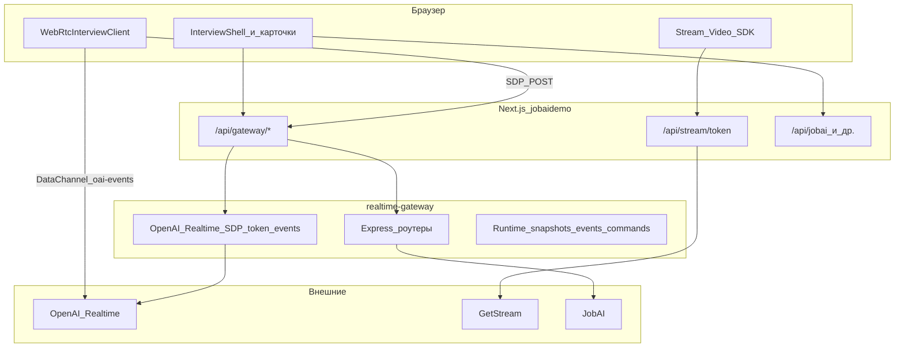
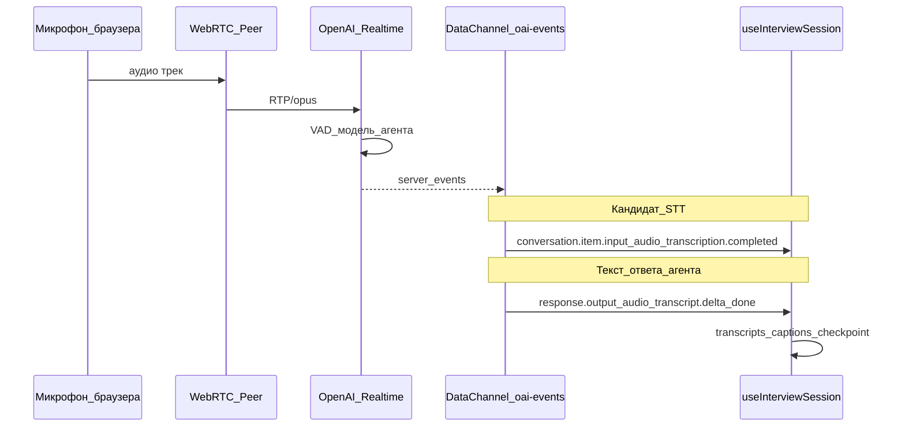

# NULLXES HR AI — системный обзор (фронт + бэкенд + API + голос/текст)

Единый документ по **монорепозиторию NULLXES HR AI**: как связаны **Next.js (`frontend/jobaidemo`)** и **`realtime-gateway` (`backend/realtime-gateway`)**, куда ходят запросы, где живёт «STT» и смежная логика. Для деталей по фронту см. [ARCHITECTURE.md](./ARCHITECTURE.md); по шлюзу — `backend/realtime-gateway/README.md` и `backend/realtime-gateway/docs/ARCHITECTURE.md` (из корня монорепо).

---

## 1. Роли компонентов

| Часть | Путь в монорепо | Роль |
|--------|-----------------|------|
| **Фронт** | `frontend/jobaidemo/` | UI (HR + кандидат), прокси к gateway, выдача Stream-токенов, WebRTC-клиент к OpenAI Realtime в браузере. |
| **Шлюз** | `backend/realtime-gateway/` | HTTP API: встречи, интервью/JobAI, runtime, join-links, прокси SDP/токенов OpenAI, webhooks, опционально Stream/аватар. |
| **JobAI** | внешний SaaS | Источник вакансий/интервью/статусов; gateway тянет и синхронизирует через `JobAiClient` / ingest / webhooks. |
| **OpenAI** | внешний API | **Realtime**: WebRTC (SDP), ephemeral token, аудио агента и **встроенная транскрипция** микрофона кандидата по каналу сессии. |
| **GetStream** | внешний API | Видеокомната (кандидат, HR-observer, аватар-под при конфиге). Токены минтит Next: `app/api/stream/token/route.ts`. |

Браузер **не** должен напрямую звать продакшен-URL шлюза из клиентского JS для основного API: используется **`/api/gateway/*`** (см. `app/api/gateway/[...path]/route.ts`).

---

## 2. Схема «кто куда ходит»

**Коротко по стрелкам**

- **Список интервью / детали / admission / meetings / runtime** — браузер → `fetch("/api/gateway/…")` → Next прокси → `BACKEND_GATEWAY_URL` на шлюзе (`lib/api.ts` + `app/api/gateway/[...path]/route.ts`).
- **Голосовой агент** — браузер держит **WebRTC** к OpenAI: SDP обмен идёт через gateway (`POST /realtime/session`), дальше медиа и события идут **напрямую** по peer (см. `lib/webrtc-client.ts`).
- **Stream** — SDK получает server-minted token с Next (`/api/stream/token`), дальше клиент ↔ GetStream.

---

## 3. Allowlist прокси gateway (фронт → шлюз)

Разрешённые **первые сегменты** пути (см. `app/api/gateway/[...path]/route.ts`):

| Корень | Назначение |
|--------|------------|
| `realtime` | SDP-сессия, token, события DataChannel, закрытие сессии, `GET /realtime/session/:id` (телеметрия). |
| `runtime` | Снимок по `meetingId`, события, команды (`issueRuntimeCommand` и т.д.). |
| `meetings` | Старт/стоп/fail встречи, admission кандидата, привязка Stream и др. |
| `interviews` | Список/деталь интервью, session-link, sync; при `JOIN_TOKEN_SECRET` — также выдача join-links (порядок монтирования на шлюзе важен). |
| `join` | Публичная верификация join JWT / session-ticket (spectator/candidate). |
| `api/v1/questions/general` | Алиас под ожидаемый JobAI-путь (tz alias). |

Всё вне этого списка прокси **вернёт 404** (`GATEWAY_PATH_FORBIDDEN`).

---

## 4. Основные HTTP API шлюза (картографически)

Полный перечень и тела запросов — в **`backend/realtime-gateway/README.md`**. Ниже — группы, с которыми чаще всего сталкивается фронт.

### 4.1. OpenAI Realtime (через шлюз)

| Метод | Путь (на шлюзе) | Кто вызывает с фронта |
|-------|-----------------|------------------------|
| `GET` | `/realtime/token` | `getRealtimeToken()` → `lib/api.ts` |
| `POST` | `/realtime/session` (body: SDP offer, `Content-Type: application/sdp`) | `createRealtimeSession()` → `WebRtcInterviewClient.connect()` |
| `POST` | `/realtime/session/:sessionId/events` | `sendRealtimeEvent()` — телеметрия и клиентские события |
| `GET` | `/realtime/session/:sessionId` | `getRealtimeSessionState()` — polling «avatar_ready» / счётчики событий |
| `DELETE` | `/realtime/session/:sessionId` | `closeRealtimeSession()` при завершении |

### 4.2. Встречи и admission

| Метод | Путь | Назначение |
|-------|------|--------------|
| `POST` | `/meetings/start` | Создание meeting + переходы статуса; фронт: `startMeeting()` |
| `POST` | `/meetings/:id/stop` | Остановка / завершение |
| `POST` | `/meetings/:id/fail` | Ошибка подключения и т.п. |
| `GET` | `/meetings/:id` | Деталь встречи |
| `GET/POST` | `/meetings/:id/admission/candidate…` | Слот кандидата, очередь, HR decision — типы в `lib/api.ts` |

### 4.3. Интервью и JobAI

| Метод | Путь | Назначение |
|-------|------|------------|
| `GET` | `/interviews` | Список (пагинация) |
| `GET` | `/interviews/:jobAiId` | Деталь + projection; `?sync=1` — подтянуть с JobAI |
| `POST` | `/interviews/:jobAiId/session-link` | Привязка `meetingId` / `sessionId` к интервью |
| Корень `/`, `/jobai/*`, `/webhooks/jobai/*` | Ingest и webhooks от JobAI (сервер-сервер) | Роутер `jobai.routes` |

Контракт полей интервью для UI: **`frontend/jobaidemo/lib/interview-detail-fields.ts`** (`extractCoreFieldsFromInterviewRaw`) — должен быть согласован с ответом `GET /interviews/:id`.

### 4.4. Runtime

| Метод | Путь | Назначение |
|-------|------|------------|
| `GET` | `/runtime/:meetingId` | Снимок (meeting, session, stream, …) |
| `GET` | `/runtime/by-interview/:jobAiId` | Снимок по JobAI id |
| `POST` | `/runtime/:meetingId/commands` | Команды в рантайм (пауза агента и др.) |
| `GET` | `/runtime/:meetingId/events` | Поллинг/SSE событий (в т.ч. для UI) |

### 4.5. Аватар (опционально)

| Префикс | Назначение |
|----------|------------|
| `/avatar/*` | События от GPU-пода, health/state по `meetingId` |

Включается конфигом (`AVATAR_*`, Stream keys) — см. логи при старте `createApp()` в `backend/realtime-gateway/src/app.ts`.

---

## 5. Где «STT» и прочая «залупа» (голос ↔ текст)

**Отдельного микросервиса STT (Whisper API, Yandex STT и т.д.) в этом стеке для основного интервью нет.** Речь кандидата и агента обрабатывается в рамках **одной OpenAI Realtime** сессии в браузере.

- **STT кандидата**: события Realtime вроде **`conversation.item.input_audio_transcription.completed`** (обработка в `hooks/use-interview-session.ts` в обработчике OpenAI events). Это не отдельный REST «/stt», а поток событий по DataChannel после включения транскрипции входа в конфигурации сессии.
- **Текст агента (параллельно аудио)**: `response.output_audio_transcript.*` / `response.audio_transcript.*` — там же в хуке; пишется в `transcripts` и чекпоинты паузы.
- **Шлюз** в этом пути: **SDP + `x-session-id`**, приём **POST `/realtime/session/:id/events`** для телеметрии и проксируемых клиентских событий; сам аудио-поток WebRTC к OpenAI **не** прогоняется телом через Express как файл.

**TTS агента**: озвучка идёт как **аудио-выход модели** (модальности `audio` + `text` в `response.create`), без отдельного ElevenLabs в текущей ветке продукта.

**Stream**: отдельный медиаконтур для видео/экрана; голос агента для кандидата в типичном режиме — **OpenAI remote audio track**, не «Stream TTS».

---

## 6. Фронт: ключевые точки входа

| Зона | Файлы |
|------|--------|
| Сессия интервью | `hooks/use-interview-session.ts`, `lib/webrtc-client.ts` |
| HTTP к шлюзу | `lib/api.ts` (базовый путь через gateway), `lib/backend-gateway-env.ts` (серверный URL) |
| Прокси | `app/api/gateway/[...path]/route.ts` |
| Stream token | `app/api/stream/token/route.ts` |
| Крупный UI | `components/interview/interview-shell.tsx`, карточки candidate/observer/avatar |
| Список интервью | `components/interview/interviews-table-preview.tsx` |

Два UX-потока на одной кодовой базе: **HR-dashboard** vs **candidate-flow** (кто может вызвать `start()` — см. хук и `AGENTS.md`).

---

## 7. Шлюз: сборка приложения

Файл **`backend/realtime-gateway/src/app.ts`** (`createApp`):

1. **Хранилища** — `storageFactory` (memory или Redis): сессии, встречи, интервью, join-token store, webhook outbox.
2. **Клиенты** — OpenAI, JobAI, interview sync, meeting orchestrator, runtime stores/snapshot, webhook pipeline.
3. **Опционально** — Stream provisioner/recording, avatar client + state.
4. **Роуты** — монтирование в порядке, указанном в разделе 4 и в `docs/ARCHITECTURE.md` шлюза (важен порядок `/interviews` vs join-links).

---

## 8. Переменные окружения (ориентир)

- **Next (Vercel)**: `BACKEND_GATEWAY_URL`, ключи Stream для `app/api/stream/token`, публичные флаги `NEXT_PUBLIC_*` (см. `.env.example`).
- **Шлюз (дроплет)**: `OPENAI_API_KEY`, Redis при tiered режиме, `STREAM_*`, `JOIN_TOKEN_SECRET`, JobAI base URL / секреты webhook — см. `backend/realtime-gateway/.env.example` и README.

---

## 9. Связанные документы

| Документ | Содержание |
|-----------|------------|
| [ARCHITECTURE.md](./ARCHITECTURE.md) | Детальная карта фронта jobaidemo. |
| `backend/realtime-gateway/README.md` | API, деплой, Docker. |
| `backend/realtime-gateway/docs/ARCHITECTURE.md` | Роуты, сервисы, mermaid шлюза. |
| `backend/realtime-gateway/UPGRADE-NOTES.md` | Миграции v1 → v2 (admission, Redis, tier). |
| `backend/README.md` | Контракт интервью, curl-примеры, admission, отладка `NEXT_PUBLIC_DEBUG_INTERVIEW_CONTEXT`. |

---

*Документ отражает архитектуру на момент добавления; при смене роутов или провайдеров голоса обновляйте таблицы вместе с кодом.*
